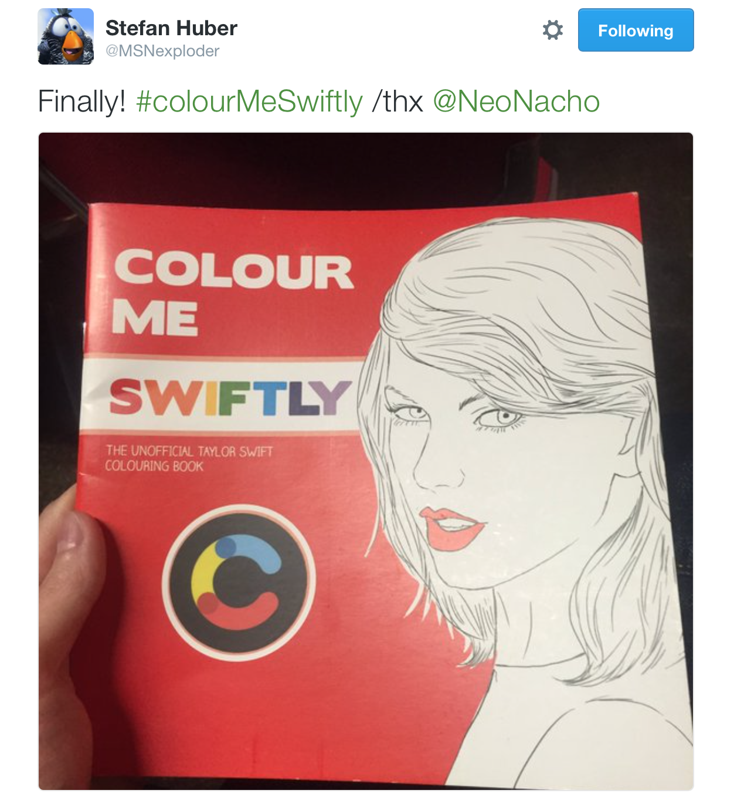
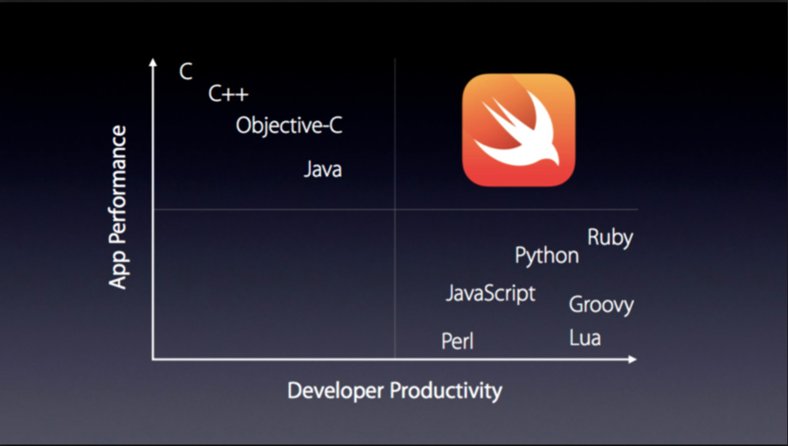
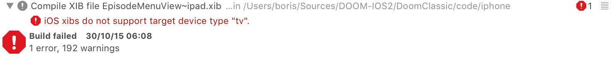
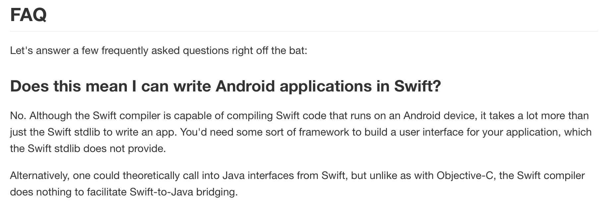
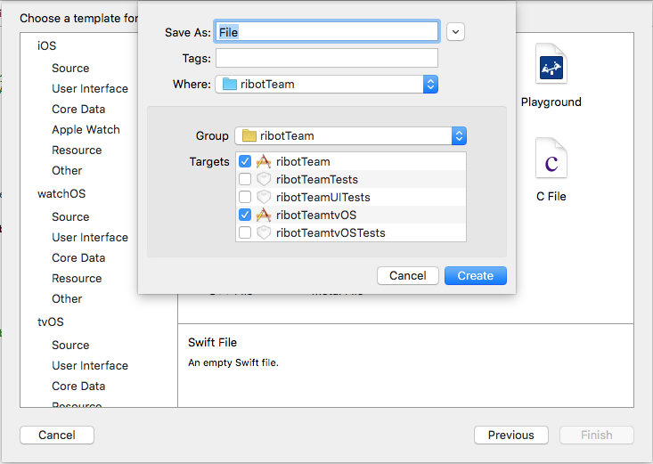
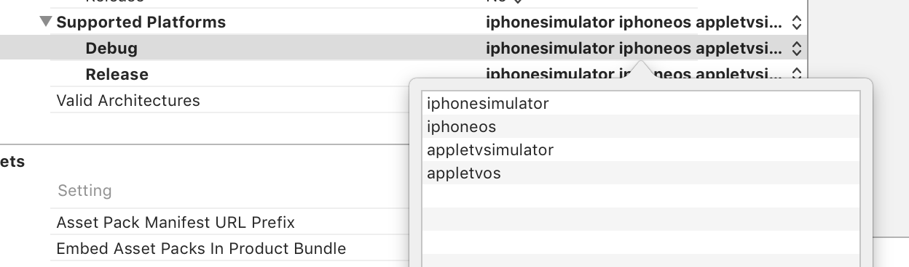
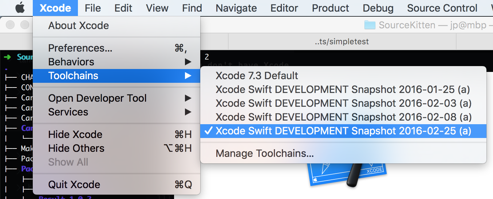
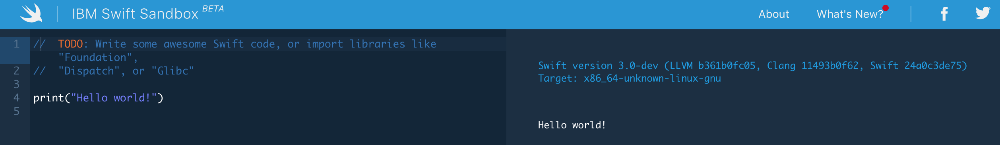
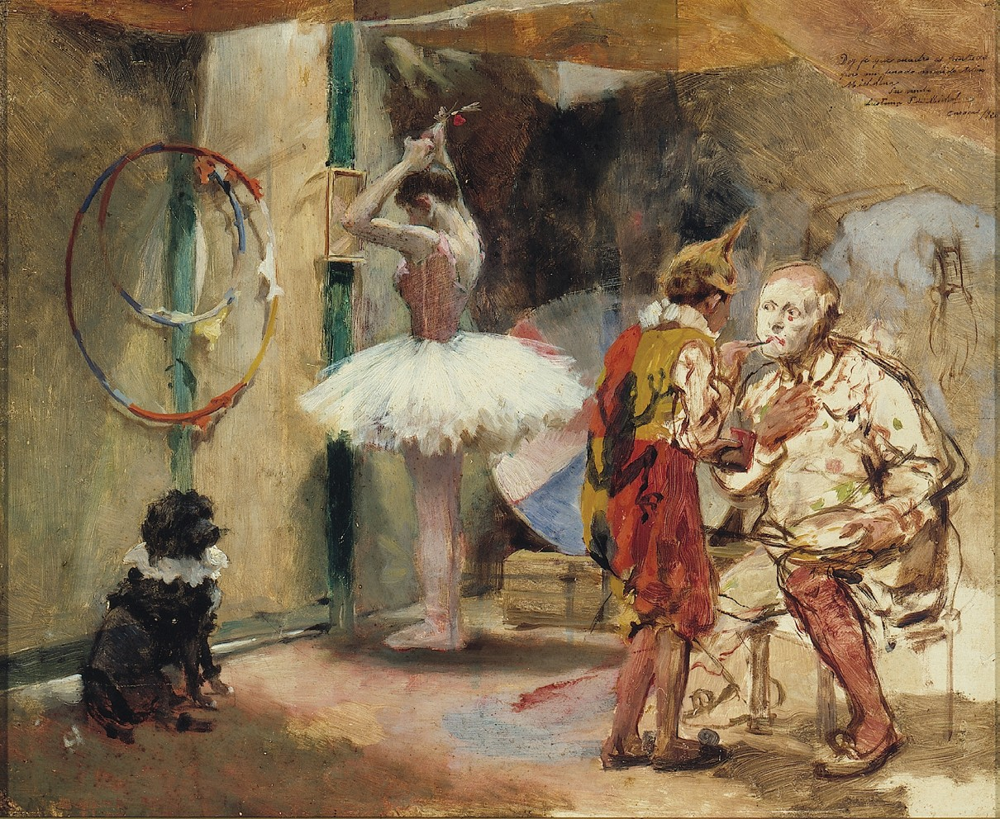
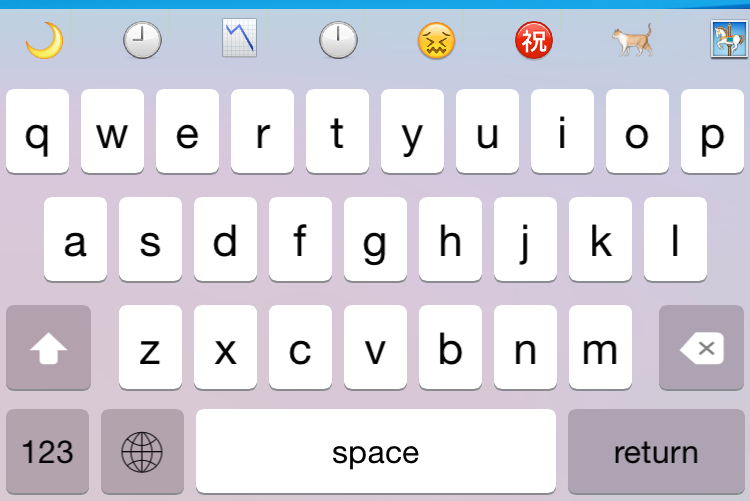

# Cross-Platform Swift

## App Builders Swizzleland, April 2016

### Boris Bügling - @NeoNacho


<!-- use Poster theme, black -->

---

## CocoaPods

<!--  -->


---

## Contentful


---


---




---

# Cross-platform Swift


---

## Why Swift?


---



---

# 😎


---

## Which platforms can we target?


---

# Apple platforms

- macOS 💻
- iOS 📱
- watchOS ⌚️
- tvOS 📺
- carOS 🚘


---

## Frameworks shared between Apple platforms

```
CFNetwork.framework
CoreData.framework
CoreFoundation.framework
CoreGraphics.framework
CoreLocation.framework
CoreText.framework
Foundation.framework
ImageIO.framework
Security.framework
```


---

## There's more depending on the subset we target

```
Accelerate.framework
AudioToolbox.framework
AudioUnit.framework
AVFoundation.framework
AVKit.framework
CloudKit.framework
CoreBluetooth.framework
```


---

## There's more depending on the subset we target

```
CoreImage.framework
CoreMedia.framework
CoreVideo.framework
EventKit.framework
GameController.framework
GameKit.framework
GLKit.framework
MapKit.framework
```


---

## There's more depending on the subset we target

```
MediaAccessibility.framework
Metal.framework
MobileCoreServices.framework
SceneKit.framework
SpriteKit.framework
StoreKit.framework
SystemConfiguration.framework
```


---

# UIKit

When only targeting `iOS` and `tvOS`


---

# NIBs 😭



If you don't feel like copy-pasting stuff between NIBs 👇

<https://github.com/neonichu/bohne>


---

# Open Source Swift

- Linux


---

# Open Source Swift

- FreeBSD (<https://github.com/apple/swift/pull/713>)
- Windows / Cygwin (<https://github.com/apple/swift/pull/1108>)
- Android (<https://github.com/apple/swift/pull/1442>)


---




---

# Importing JNI into Swift

```c
module CJavaVM [system] {
    header "jni.h"
    link "jvm"
    export *
}
```

---

# Calling Java using JNI from Swift

```swift
import CJavaVM

var vm: UnsafeMutablePointer<JavaVM> = nil
let env = create_vm(&vm)
let jni = env.pointee.pointee

let hello_class = jni.FindClass(env, "helloWorld")

let main_method = jni.GetStaticMethodID(env, hello_class,
  "main", "([Ljava/lang/String;)V")
jni.CallStaticVoidMethodA(env, hello_class, main_method, [])
```

---

## A *really* long way to go 🏃


---

## Frameworks shared between **all** platforms

```
Foundation.framework
```

<https://github.com/apple/swift-corelibs-foundation>


---

## Foundation is incomplete and sometimes different from OS X

```swift
#if os(Linux)
      let index = p.startIndex.distanceTo(p.startIndex.successor())
      path = NSString(string: p).substringFromIndex(index)
#else
      path = p.substringFromIndex(p.startIndex.successor())
#endif
```

---

# Apple's goal

- Be compatible with Swift 3.0
- Scheduled to ship by the end of 2016


---

## Some things in the standard library might not be available

```objectivec
#if _runtime(_ObjC)
// Excluded due to use of dynamic casting and Builtin.autorelease, neither
// of which correctly work without the ObjC Runtime right now.
// See rdar://problem/18801510
[...]
public func getVaList(args: [CVarArgType]) -> CVaListPointer {
```

---

## Even libc is problematic

```swift
#if os(Linux)
import Glibc
#else
import Darwin.C
#endif
```

---

## e.g. struct members can be completely different

```swift
let flags = GLOB_TILDE | GLOB_BRACE | GLOB_MARK
    if system_glob(cPattern, flags, nil, &gt) == 0 {
#if os(Linux)
      let matchc = gt.gl_pathc
#else
      let matchc = gt.gl_matchc
#endif
```

---

## => it's complicated


---

## but only *right* now


---

## How to share code between them


---

- Shared files
- Shared frameworks
- Shared packages


---

# Shared files




---

# Build configurations

- os(): OSX, iOS, watchOS, tvOS, Linux
- arch(): x86_64, arm, arm64, i386


---

# Using build configurations

```swift
#if os(OSX)
print("Running on OS X")
#elseif os(watchOS)
print("Running on watchOS")
#else
print("Running on any platform but OS X and watchOS")
#end
```

---

## Can also be used to distinguish versions (SE-0020)

```swift
#if swift(>=2.2)
  print("Active!")
#else
  this! code! will! not! parse! or! produce! diagnostics!
#endif
```

---

## Or to see if your code is being built by swiftpm

```swift
#if SWIFT_PACKAGE
import Foundation
#endif
```

---

# Shared frameworks




---

## [Xcode 7 beta] Linking dual (iphoneos and watchos) frameworks with same product name causes archive to fail

<http://openradar.appspot.com/22392501>


---

# Shared packages/libraries

- CocoaPods
- Carthage
- Swift Package Manager


---

# CocoaPods

```json
  "platforms" : {
    "osx" : "10.10",
    "ios": "8.0",
    "watchos": "2.0",
    "tvos": "9.0"
  }
```


---

## If a Pod does not support a certain platform

- Fork and add it
- Submit a PR
- For the adventurous 👇

<https://github.com/orta/cocoapods-expert-difficulty>


---

# CocoaPods avoids 22392501

- Each duplicated target gets scoped
- <.../Build/Debug-iphoneos/Pods-UserTarget/*.framework>


---

# Conche

- Deprecated now, but nice example of what package manifests enable

```bash
$ conche build
Downloading Dependencies
-> PathKit 0.5.0
-> Commander 0.5.0
Building Dependencies
-> PathKit
-> Commander
Building Conche
Building Entry Points
-> conche -> .conche/bin/conche
```


---

# Carthage

- Essentially a nicer way to do shared frameworks


---

# Swift Package Manager

- Currently the only way to target Linux
- Does not support iOS, watchOS or tvOS, though


---

# Swift Package Manager

- No real platform syntax, but can use build configs:

```swift
import PackageDescription

var package = Package()

#if os(Linux)
let target = Target(name: "LinuxSources/foo")
package.targets.append(target)
#endif
```


---

# Current status

- Use swiftpm for OS X and Linux
- Use CocoaPods for the iOS-ish platforms
- Use build configurations to distinguish


---

# Development Environment


---

- Xcode
- Xcode + Swift Toolchain
- Any editor + `swift build`


---




---

# Swift versions

```bash
$ cat .swift-version 
swift-2.2-SNAPSHOT-2015-12-22-a
```

- Is read by either `chswift` or `swiftenv`


---

## How to test/develop for Linux?


---

# IBM Swift Sandbox



- No third party dependencies
- Limited to 65535 characters in a source file


---

# Docker

Easiest way on OS X: dlite 
<https://github.com/nlf/dlite/releases>

```bash
$ brew install dlite docker
$ sudo dlite install
$ docker run -it ubuntu bash
```



---

# Docker

- A Swift `Dockerfile`
e.g. <https://github.com/IBM-MIL/Samples/tree/master/docker-swift>

```bash
$ docker build -t swift ./
$ docker run -it swift /bin/bash
$ docker ps # Get 'CONTAINER ID'
```

- or `docker pull swiftdocker/swift`


---

# Docker

If you don't want to create new containers all the time:

```bash
$ docker start XXXX
$ docker exec -it XXXX /bin/bash
$ docker stop XXXX
```


---

# Heroku

- <https://github.com/neonichu/swift-buildpack>
- <https://github.com/kylef/heroku-buildpack-swift>

```bash
$ heroku run bash
```


---

# CI


---

# Travis CI

```haml
os:
- linux
- osx
language: generic
sudo: required
dist: trusty
osx_image: xcode7.2
install:
- curl -sL https://gist.github.com/kylef/
5c0475ff02b7c7671d2a/raw/
621ef9b29bbb852fdfd2e10ed147b321d792c1e4/swiftenv-install.sh | bash
script:
- . ~/.swiftenv/init
```


---

# Practical example


---

# Emoji!

### 😀  😁  😂  😃  😄  😅  😆  😉  😊  😋  😎  😍  😘  😗  😙  😚  🙂  🤗  😇  🤔  😐  😑  😶  🙄  😏  😣  😥  😮  🤐  😯  😪  😫  😴  😌  🤓  😛  😜  😝


---

# electronic-moji

```swift
import Foundation
import Regex

extension Character {
  public var unicodeName: String {
    let mutableString = NSMutableString(string: "\(self)")
    CFStringTransform(mutableString, nil, kCFStringTransformToUnicodeName, false)
    let unicodeName = "\(mutableString)".lowercaseString
    let regex = Regex(".*\\{(.*)\\}")
    return regex.match(unicodeName)?.captures.first.flatMap { $0 } ?? unicodeName
  }
}

extension CollectionType where Generator.Element == Character {
  public func findUnicodeName(term: String) -> [Character] {
    let regex = Regex(".*\(term).*")
    return self.filter { regex.matches($0.unicodeName) }
  }
}
```

---

# Frank

Frank is a DSL for quickly writing web applications in Swift with type-safe path routing.

<https://github.com/nestproject/Frank>


---

```swift
import Emoji
import Frank

get { _ in
  return "Hello 🇨🇭\n"
}

get(*) { (_, name: String) in
  return (EMOJI.findUnicodeName(name)
    .map { "\($0)" }
    .first ?? "¯\\_(ツ)_/¯") + "\n"
}
```

---

# Demo


---

```bash
.build/debug/example
[2016-04-26 10:21:09 +0200] [65201] [INFO] Listening at http://0.0.0.0:8000 (65201)
[2016-04-26 10:21:09 +0200] [65202] [INFO] Booting worker process with pid: 65202
[worker] GET / - 200 OK
[worker] GET /glasses - 200 OK
[worker] GET /nerd - 200 OK
```

```bash
$ curl http://0.0.0.0:8000
Hello 🇨🇭
$ curl http://0.0.0.0:8000/glasses
😎
$ curl http://localhost:8000/nerd
🤓
```

---

# emoji search keyboard



<https://github.com/neonichu/emoji-search-keyboard>

---

# CLI tool

```bash
$ electronic-moji bird
🐦
```


---

# Conclusion

- It's complicated :)
- Still a lot of code *can* be shared
- Swift 3.0 will help a lot


---

# Thank you!


---

# References

- <https://swift.org>
- <https://github.com/neonichu/freedom>
- <https://github.com/kylef/swiftenv>
- <https://github.com/nestproject/Frank>
- <https://speakerdeck.com/jpsim/practical-cross-platform-swift>
- <https://speakerdeck.com/kylef/end-to-end-building-a-web-service-in-swift-mce-2016>


---

> “Experienced engineer examines comments in a legacy module”
--=> <http://classicprogrammerpaintings.com>


---

-

-

-

@NeoNacho

boris@contentful.com

http://buegling.com/talks


