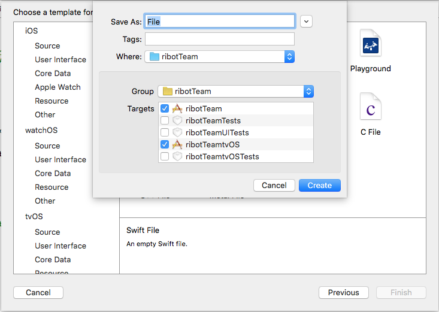
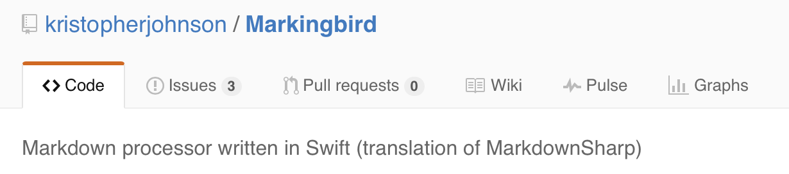
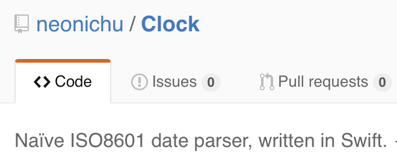

# Cross-Platform Swift

## mdevcon, March 2016

### Boris Bügling - @NeoNacho


<!--- use Poster theme, black -->

---

## CocoaPods


---

## Contentful


---

# Agenda

- Which platforms can we target?
- How to share code between them
- Development Environment
- Practical Examples

---

## Which platforms can we target?

---

# Apple platforms

- OS X
- iOS
- watchOS
- tvOS

---

## Frameworks shared between Apple platforms

```
CFNetwork.framework
CoreData.framework
CoreFoundation.framework
CoreGraphics.framework
CoreLocation.framework
CoreText.framework
Foundation.framework
ImageIO.framework
Security.framework
```

---

## There's more depending on the subset we target

```
Accelerate.framework
AudioToolbox.framework
AudioUnit.framework
AVFoundation.framework
AVKit.framework
CloudKit.framework
CoreBluetooth.framework
```

---

## There's more depending on the subset we target

```
CoreImage.framework
CoreMedia.framework
CoreVideo.framework
EventKit.framework
GameController.framework
GameKit.framework
GLKit.framework
MapKit.framework
```

---

## There's more depending on the subset we target

```
MediaAccessibility.framework
Metal.framework
MobileCoreServices.framework
SceneKit.framework
SpriteKit.framework
StoreKit.framework
SystemConfiguration.framework
```

---

# UIKit

When only targeting `iOS` and `tvOS`

---

# NIBs 😭


If you don't feel like copy-pasting stuff between NIBs 👇

<https://github.com/neonichu/bohne>

---

# Open Source Swift

- Linux

---

# Open Source Swift

- FreeBSD (<https://github.com/apple/swift/pull/713>)
- Windows / Cygwin (<https://github.com/apple/swift/pull/1108>)

---

# Open Source Swift

- Android (soon™)

<https://github.com/apple/swift/pull/1442>

---

## Frameworks shared between **all** platforms

```
Foundation.framework
```

<https://github.com/apple/swift-corelibs-foundation>

---

## Foundation is incomplete and sometimes different from OS X

```swift
#if os(Linux)
      let index = p.startIndex.distanceTo(p.startIndex.successor())
      path = NSString(string: p).substringFromIndex(index)
#else
      path = p.substringFromIndex(p.startIndex.successor())
#endif
```

---

# Apple's goal

- Be compatible with Swift 3.0
- Scheduled to ship by the end of 2016

---

## Even some things in the standard library might not be available

```objectivec
#if _runtime(_ObjC)
// Excluded due to use of dynamic casting and Builtin.autorelease, neither
// of which correctly work without the ObjC Runtime right now.
// See rdar://problem/18801510
[...]
public func getVaList(args: [CVarArgType]) -> CVaListPointer {
```

---

## Even libc is problematic

```swift
#if os(Linux)
import Glibc
#else
import Darwin.C
#endif
```

---

```swift
let flags = GLOB_TILDE | GLOB_BRACE | GLOB_MARK
    if system_glob(cPattern, flags, nil, &gt) == 0 {
#if os(Linux)
      let matchc = gt.gl_pathc
#else
      let matchc = gt.gl_matchc
#endif
```

---

## And other random fun

```
./.build/debug/spectre-build
/usr/bin/ld: .build/debug/Clock.a(ISO8601Parser.swift.o): 
undefined reference to symbol '_swift_FORCE_LOAD_$_swiftGlibc'
/home/travis/.swiftenv/versions/swift-2.2-SNAPSHOT-2015-12-22-a/
usr/lib/swift/linux/libswiftGlibc.so: error adding symbols: DSO 
missing from command line
clang: error: linker command failed with exit code 1 (use -v to see invocation)
```

---

## => it's complicated

---

## How to share code between them

---

- Shared files
- Shared frameworks
- Shared packages

---

# Shared files



---

# Build configurations

- os(): OSX, iOS, watchOS, tvOS, Linux
- arch(): x86_64, arm, arm64, i386

---

```swift
#if os(OSX)
print("Running on OS X")
#elseif os(watchOS)
print("Running on watchOS")
#else
print("Running on any platform but OS X and watchOS")
#end
```

---

# Shared frameworks


---

## [Xcode 7 beta] Linking dual (iphoneos and watchos) frameworks with same product name causes archive to fail

<http://openradar.appspot.com/22392501>

---

# Shared packages

- CocoaPods
- Carthage
- Swift Package Manager

---

# CocoaPods

```json
  "platforms" : {
    "osx" : "10.10",
    "ios": "8.0",
    "watchos": "2.0",
    "tvos": "9.0"
  }
```

---

## If a Pod does not support a certain platform

- Fork and add it
- Submit a PR
- For the adventurous 👇

<https://github.com/orta/cocoapods-expert-difficulty>

---

# CocoaPods avoids 22392501

- Each duplicated target gets scoped
- <.../Build/Debug-iphoneos/Pods-UserTarget/*.framework>

---

# Conche

- Deprecated now, but nice example of what package manifests enable

```
$ conche build
Downloading Dependencies
-> PathKit 0.5.0
-> Commander 0.5.0
Building Dependencies
-> PathKit
-> Commander
Building Conche
Building Entry Points
-> conche -> .conche/bin/conche
```

---

# Carthage

- Essentially a nicer way to do shared frameworks

---

# Swift Package Manager

- Currently the only way to target Linux
- Does not support iOS, watchOS or tvOS, though

---

# Swift Package Manager

- No real platform syntax, but can use build configs:

```swift
import PackageDescription

var package = Package()

#if os(Linux)
let target = Target(name: "LinuxSources/foo")
package.targets.append(target)
#endif
```

---

# Development Environment

---

- Xcode
- Xcode + Swift Toolchain
- Any editor + `swift build`

---


---

# Swift versions

```bash
$ cat .swift-version 
swift-2.2-SNAPSHOT-2015-12-22-a
```

- Is read by either `chswift` or `swiftenv`

---

## How to test/develop for Linux?

---

# IBM Swift Sandbox


- No third party dependencies
- Limited to 65535 characters in a source file

---

# Docker

- Easiest way on OS X: dlite 
<https://github.com/nlf/dlite/releases>
- A Swift `Dockerfile`
e.g. <https://github.com/IBM-MIL/Samples/tree/master/docker-swift>
- or `docker pull swiftdocker/swift`

---

# Docker

First time:

```bash
$ docker build -t swift ./
$ docker run -it swift /bin/bash
$ docker ps # Get 'CONTAINER ID'
```

Subsequently:

```bash
$ docker start XXXX
$ docker exec -it XXXX /bin/bash
$ docker stop XXXX
```

---

# Heroku

- <https://github.com/neonichu/swift-buildpack>
- <https://github.com/kylef/heroku-buildpack-swift>

`heroku run bash`

---

# CI

---

# Travis CI

```haml
os:
- linux
- osx
language: generic
sudo: required
dist: trusty
osx_image: xcode7.2
install:
- curl -sL https://gist.github.com/kylef/
5c0475ff02b7c7671d2a/raw/
621ef9b29bbb852fdfd2e10ed147b321d792c1e4/swiftenv-install.sh | bash
script:
- . ~/.swiftenv/init
```

---

# Conclusion

- It's complicated :)
- Still a lot of code *can* be shared
- Swift 3.0 will help a lot

---

# Practical Examples

---

# Markingbird



- Currently runs on OS X and iOS
- Let's make it work for the other platforms!

---

# Clock



- Checkout the commit `6dd6071`
- How could we support Linux here?

---

# Alamofire


- Can we add Linux support?

---

# Other possibilities

- HanekeSwift
- SwiftyJSON
- Pick something else from <http://swift.pm> or <https://gist.github.com/orta/1c607a2c46545244ab16>

---

## References

- <https://swift.org>
- <https://github.com/apple/swift-package-manager>
- <https://github.com/apple/llbuild>
- <https://github.com/neonichu/chocolat>
- <https://github.com/neonichu/freedom>
- <https://github.com/kylef/swiftenv>
- <https://speakerdeck.com/jpsim/practical-cross-platform-swift>

---

# Thank you!


---

@NeoNacho

boris@contentful.com

http://buegling.com/talks


